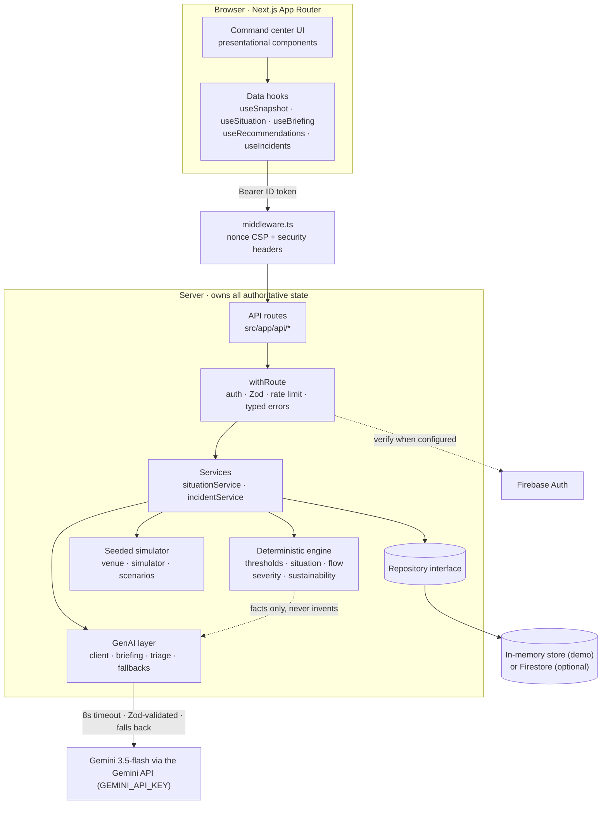

# SENTINEL — AI Command Center for Stadium Operations

**▶ Live:** _<add your Vercel URL here after the first deploy>_ (deployed on Vercel)

> _Built as part of a team; adapted from our NEXUS project._

SENTINEL is the AI teammate in a major-event stadium control room. It watches every
operational feed, **spots crowd danger before it happens, tells the operator what to
do and why, and lets any volunteer report an incident in any language and get an
instant, triaged response.**

The whole app runs from a single demo entry — **no sign-in, no cloud project** — so
you can open it and go straight to the console.

---

## The 20-second demo

1. Open the **command center**. A normal matchday at **Citadel Stadium** (99,000
   capacity) is filling; overall status reads **Normal**.
2. Pick the **"Gate E1 surge"** scenario from the picker.
3. Watch the engine react: the status pill climbs **Normal → High → Critical** and
   pulses, the schematic tints, and the **AI briefing rewrites itself in plain
   language** — _"Gate E1 is taking 215 arrivals a minute but can only process 195…
   the queue is growing by 20 people a minute."_
4. A **recommendation** appears with reasoning **and a real, engine-computed impact
   number**: _"Open the overflow lane at Gate E1. Utilization 110.1% → 91.7%."_
5. Switch to **Incidents**, type _"eine Person ist in Block 118 zusammengebrochen"_,
   and watch it get detected as German, translated, and triaged **SEV-1 → Medical
   Response** — with the exact rule that fired quoted for audit.

That whole arc works **with the AI switched off** (rule-based mode) — see below.

## The one idea that makes this trustworthy

> **The AI has no shape in which to express a safety number.**

Generative AI is the product's brain — it writes the briefings, explains the
decisions, and understands incident reports in 30+ languages. But it is
**structurally prevented** from deciding anything safety-critical:

- The model's incident-triage output schema
  ([`triageProposalSchema`](src/lib/ai/triage.ts)) **has no `severity` field and no
  `team` field.** There is no shape in which it can express a triage decision. It
  proposes a _category_; the deterministic engine
  ([`classifySeverity`](src/lib/engine/severity.ts)) decides severity and routing
  from a keyword table, scanning **both** the raw report and the translation so a
  mistranslation cannot launder an emergency into a routine report. A life-safety
  keyword overrides the model's proposed category outright.
- Every crowd number, threshold, ETA, and "94% → 78%" impact figure comes from a
  pure, tested engine ([`src/lib/engine/`](src/lib/engine/)). The LLM is handed
  those facts and asked only to explain them.

The consequence is **testable, and tested**:
[`tests/ai/triage.test.ts`](tests/ai/triage.test.ts) asserts that **AI mode and
rule-based mode reach identical severity on life-safety reports across English,
Spanish, Bengali, and Hindi.** With Gemini switched off entirely, a "person collapsed"
report is still SEV-1, still routed to Medical Response.

The [`/methodology`](src/app/methodology/page.tsx) page renders this claim, the
density thresholds and their sources, and the severity rules — every number imported
from the engine, not transcribed.

---

## Architecture



**Layering is strict:** route → `withRoute` → service → engine/ai/repository. The
engine is a pure function of its inputs; the simulator is a pure function of
`(scenario, tick)`; the AI is always last and always optional. The server owns every
safety-critical value — the client never computes one.

Key directories:

| Path                                 | Responsibility                                                                                               |
| ------------------------------------ | ------------------------------------------------------------------------------------------------------------ |
| [`src/lib/engine/`](src/lib/engine/) | Pure, tested safety math: thresholds, risk assessment, crowd-flow model, severity rules, sustainability.     |
| [`src/lib/sim/`](src/lib/sim/)       | Seeded, deterministic simulator. Pure function of `(scenario, tick)` so multiple serverless instances agree. |
| [`src/lib/ai/`](src/lib/ai/)         | Gemini client (timeout + Zod + fallback), briefings, triage, deterministic fallbacks.                        |
| [`src/lib/server/`](src/lib/server/) | Auth, the `withRoute` edge harness, typed errors, repository interface + Firestore impl + in-memory double.  |
| [`src/lib/ui/`](src/lib/ui/)         | Typed API client, data hooks, one polling primitive, status vocabulary.                                      |
| [`src/components/`](src/components/) | Radix-based, accessible, presentational components.                                                          |

The demo venue lives in one place — [`src/lib/sim/venue.ts`](src/lib/sim/venue.ts):
Citadel Stadium, 99,000 safe capacity, **8 zones** (North/South Stand Lower & Upper,
East/West Atrium & Grandstand), **6 gates** (N1, N2, E1, E2, S1, W1), **4 transit
lines** (Central, Harbour, Airport Rail, Park & Ride). Five scenarios drive it:
normal matchday, Gate E1 surge, Central Line delay, medical incident, and a heat wave.

---

## Rubric-axis mapping

| Axis                         | How, with references                                                                                                                                                                                                                                                                                                                                                                  |
| ---------------------------- | ------------------------------------------------------------------------------------------------------------------------------------------------------------------------------------------------------------------------------------------------------------------------------------------------------------------------------------------------------------------------------------- |
| **GenAI centrality**         | Briefings ([`ai/briefing.ts`](src/lib/ai/briefing.ts)), decision reasoning, and multilingual triage ([`ai/triage.ts`](src/lib/ai/triage.ts)) are all genuinely model-generated and load-bearing. Every AI route returns `mode: 'ai' \| 'rule'` so the UI shows which path served it.                                                                                                  |
| **Safety / trustworthiness** | The LLM cannot set a severity, threshold, or crowd number — enforced by the schema shape, not convention. [`tests/ai/triage.test.ts`](tests/ai/triage.test.ts): "AI and rule modes reach identical severity" across 4 languages.                                                                                                                                                      |
| **Resilience**               | Every AI call has an 8s timeout, Zod output validation, and a deterministic fallback ([`ai/fallbacks.ts`](src/lib/ai/fallbacks.ts)). Tested in [`tests/ai/`](tests/ai/) and end-to-end in [`e2e/demo-arc.spec.ts`](e2e/demo-arc.spec.ts).                                                                                                                                             |
| **Code quality**             | TypeScript strict, strict ESLint (complexity, max-lines-per-function, import/order) with **zero warnings**, Prettier-clean. Layered architecture, repository interface + test double, Zod config module ([`config.ts`](src/lib/config.ts)), typed errors ([`server/errors.ts`](src/lib/server/errors.ts)).                                                                            |
| **Security**                 | Zod on every route, Firebase ID-token verification ([`server/auth.ts`](src/lib/server/auth.ts)), deny-all Firestore rules ([`firestore.rules`](firestore.rules)), nonce CSP + security headers ([`middleware.ts`](src/middleware.ts)), the **Gemini API key is server-only (never `NEXT_PUBLIC_`, never in the client bundle)**, rate-limited AI routes, `npm audit` 0 high/critical. |
| **Testing**                  | **480 unit/integration tests (all green)** plus a Playwright E2E demo arc. Engine + sim carry enforced coverage thresholds ([`vitest.config.ts`](vitest.config.ts)); route tests cover 401/400/404/429 and AI-failure/fallback paths.                                                                                                                                                 |
| **Accessibility**            | axe asserted in component tests _and_ real-browser E2E. Semantic landmarks, one `<h1>`/page, `aria-live` on updating panels, status always paired with a text label + icon ([`ui/status.ts`](src/lib/ui/status.ts)), keyboard-operable Radix controls, `prefers-reduced-motion` honored.                                                                                              |
| **Efficiency**               | Firebase kept off public pages, panels memoised, zero CLS, modern browserslist, charts code-split off the shared bundle.                                                                                                                                                                                                                                                              |
| **Problem alignment**        | Crowd management, real-time decision support, multilingual assistance, accessibility, transport, and sustainability — each a first-class feature, covered deeply rather than broadly.                                                                                                                                                                                                 |

---

## Run it locally

Nothing external is required to see it run. In demo mode the whole app works with no
Firebase project and no sign-in; with no Gemini key, every AI feature runs in
deterministic rule-based mode.

```bash
npm install
cp .env.example .env.local   # already set up for demo mode (AUTH_BYPASS=1)
npm run dev                  # http://localhost:3000
```

To light up the **real AI path**, paste a Gemini API key
(from <https://aistudio.google.com/apikey>) into `GEMINI_API_KEY` in `.env.local` and
restart. Every AI panel will then render with an **AI** badge instead of **Rule-based**.

Quality gates:

```bash
npm run typecheck      # tsc --noEmit (strict)
npm run lint           # strict ESLint, zero warnings
npm run format:check   # Prettier
npm run test           # 480 unit/integration tests
npm run test:coverage  # with the engine/sim coverage gate
npm run e2e            # Playwright: demo arc + AI-down degradation
npm run build          # production build
```

---

## Deploy on Vercel

Vercel builds and serves Next.js natively — there is no Docker image, no
`output: 'standalone'`, nothing Cloud-specific to configure.

1. Push this repo to GitHub and **Import** it in the Vercel dashboard (framework
   preset: Next.js — auto-detected).
2. Add these **Environment Variables** in Vercel → Project → Settings →
   Environment Variables:

   | Variable         | Value      | Notes                                                                     |
   | ---------------- | ---------- | ------------------------------------------------------------------------- |
   | `GEMINI_API_KEY` | _your key_ | From <https://aistudio.google.com/apikey>. Server-only. Omit → rule mode. |
   | `AUTH_BYPASS`    | `1`        | Runs the app in demo mode (no Firebase project / no sign-in).             |

3. Deploy. That's it — the live URL is your command center.

> **Optional — real auth + persistence.** To run with real Google sign-in and
> Firestore instead of demo mode, leave `AUTH_BYPASS` unset and add the six
> `NEXT_PUBLIC_FIREBASE_*` values from your Firebase web-app config (see
> [`.env.example`](.env.example)).

---

## Honest notes

- **Demo-mode auth bypass.** An explicit, opt-in `AUTH_BYPASS=1` env flag skips
  Firebase token verification and uses an in-memory incident store, so the whole
  product can be exercised with no cloud project. It is **never on by accident** —
  [`tests/api/auth.test.ts`](tests/api/auth.test.ts) asserts a production request
  without the flag is always rejected. In that build the AI rate limiter is also
  skipped because every request shares one synthetic identity; the real build
  enforces it, and the route tests cover it.
- **`npm audit`.** Zero **high/critical**. The remaining moderate advisories are
  dev-only transitive dependencies of `firebase-admin` and `next` that never ship to
  the browser. `npm audit --audit-level=high` exits clean.
- **The simulator is fake, and says so.** The operational feed is a seeded
  deterministic simulation — but it conserves people, models a transit delay as the
  same crowd arriving later and tighter, and is calibrated so a normal matchday peaks
  at "high" (never a permanently-critical dashboard). The
  [`/methodology`](src/app/methodology/page.tsx) page is explicit about this.

## Stack

Next.js 15 (App Router) · React 19 · TypeScript strict · Tailwind v4 · Radix UI · Zod ·
Firebase Auth + Firestore (optional) · **Gemini 3.5-flash via the Gemini API
(`@google/generative-ai`)** · Vitest + Testing Library + vitest-axe · Playwright +
axe-core · deployed on Vercel.

## License

[MIT](LICENSE) © 2026 Thanishka.
